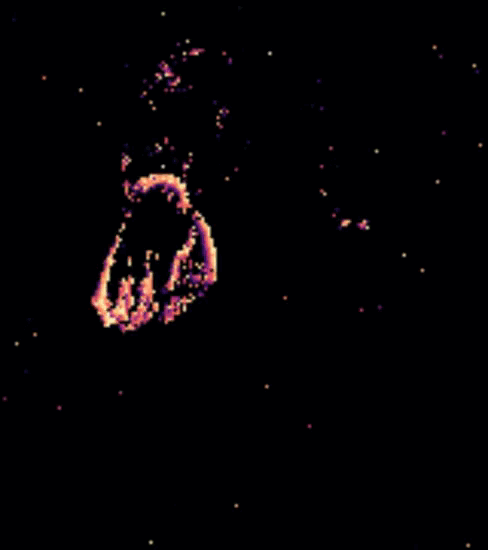
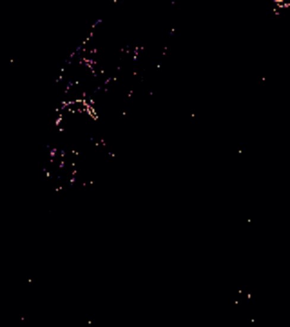

# DavisHandDataset-Events
This repository contains the Davis Hand Dataset, that represent manipulation actions recorded using event cameras. This dataset consist of 30 different manipulation actions using 6 objects. 
The 30 classes included in this dataset are the following:
- cup
    - drink, pound, shake, move, pour
- stone
  - pound, move, play, grind, carve 
- sponge
  - squeeze, flip, wash, wipe, scratch
- spoon
  - scoop, stir, hit, eat, sprinkle
- knife
  - cut, chop, poke a hole, peel, spread
- spatula
  - flip, lift, cut, squeeze, scrape

Refer to [classes.json](classes.json) to check the ID of every action.

Additionally, the examples were recorded by 5 different subjects (S1, S2, S3, S4 and S5). Each subject recorded five instances of every action. 
Therefore, each class has 25 samples, which results in 750 examples recorded with events with an average duration of 3 seconds.

## Dataset retrieval process
To obtain and download the dataset you should:
```bash
git clone https://github.com/DaniDeniz/DavisHandDataset-Events.git
cd DavisHandDataset-Events
./setup_data.sh
```

This script will download a zip with the event data. The zip includes two folders. One folder (AllEvents) include all the events recorded from the DAVIS camera, the second folder (TrackerEvents) include only the events that occur
around the hand of the subject (we used a hand tracker). With this, we reduce the number of events required to analyze the sequences and identify the activities.

The event sequences are represented using .npy files that can be opened using numpy. The data is organized as follows: 6 folders for each of the objects, and then, each of that folders include 5 folders representing the different activities. 
Finally, the actions folders has 5 .npy files with events recorded from 5 subjects (25 in total).

Additionally, the above script also splits the data into train, validation and test. Concretely, the script create 6 datasets using the event data:
- **all_davis_hand_dataset_npy**: data randomly splitted into train, validation and test
- **s1_davis_hand_dataset_npy**: data of s1 used exclusively for test
- **s2_davis_hand_dataset_npy**: data of s2 used exclusively for test
- **s3_davis_hand_dataset_npy**: data of s2 used exclusively for test
- **s4_davis_hand_dataset_npy**: data of s2 used exclusively for test
- **s5_davis_hand_dataset_npy**: data of s2 used exclusively for test

## Read event data
Once the event data is downloaded, we can read it using numpy. To do that, for example, you should:

```python
import numpy as np
events_segment = np.load("s1_segment_001.npy", allow_pickle=True).item()
```

The events object is organized as a dictionary with the following keys:
- x: positions of the events in the x axis (horizontal)
- y: positions of the events in the y axis (vertical)
- ts: timestamp in microseconds underlining when the asynchronous event occurred
- p: polarity value (-1 or 1)
- max_width: higher width position (useful when building time surfaces)
- max_height: higher height position (useful when building time surfaces)

With this information, it is possible to build time surfaces using the event data. In particular, you can create time surfaces
using different algorithms establishing a concrete value of tau to show the sequence of events as a video. 
(Refer to [tutorial_read_events.ipynb](tutorial_read_events.ipynb) for further details)

<div style="display:flex;justify-content:center;margin: 0 auto; text-align: center">
  <span style="padding: 10px">
    <p>Action: Cup pour</p>
    
  </span>
  
  <span style="padding: 10px">
    <p>Action: Spatula lift</p>
    
  </span>
</div>